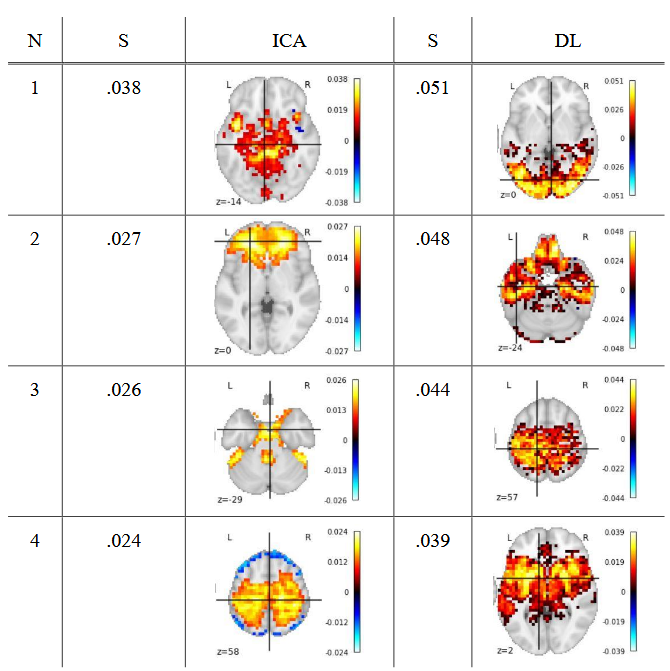
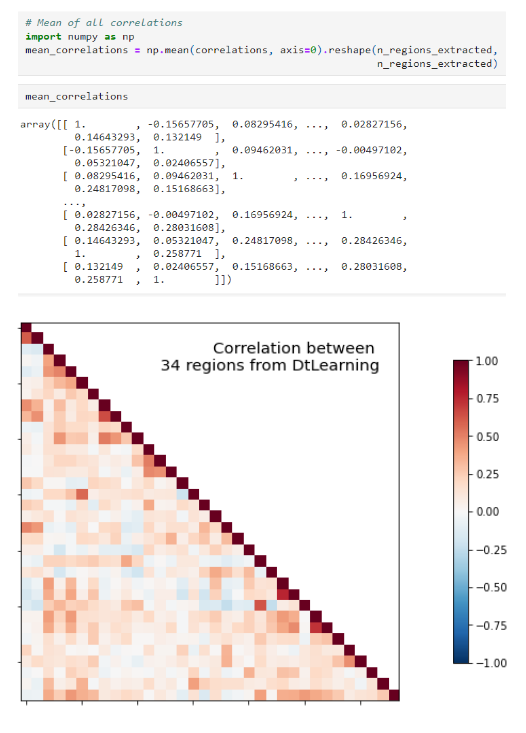
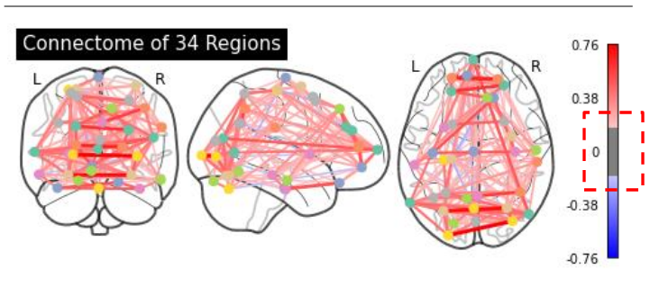
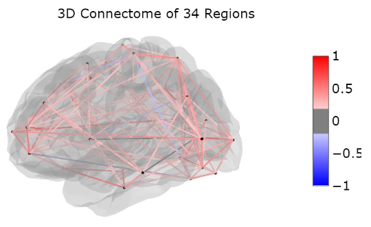

# Machine-Learning-Apppplications-in-fMRI

Extend application exercises of fmri by nilearn
This project only used personal for the application project

## Research Workflow Diagrom

## Research result of ROI

## Research result of functional connectome

## Research result of region

## Research result of visualization

# Origin Source

Origin source coubld be found at nilearn website
Which includes canICA or Dictionary learning and the functional connective

URL=https://nilearn.github.io/stable/auto_examples/index.html

# Acknowladge

Nilearn enables approachable and versatile analyses of brain volumes. It provides statistical and machine-learning tools, with instructive documentation & friendly community.

It supports general linear model (GLM) based analysis and leverages the scikit-learn Python toolbox for multivariate statistics with applications such as predictive modeling, classification, decoding, or connectivity analysis.

Important links

Official source code repo: [https://github.com/nilearn/nilearn/](https://github.com/nilearn/nilearn/)  
HTML documentation (stable release): [https://nilearn.github.io/](https://nilearn.github.io/)

# For further information about nilearn

## Machine learning for neuroimaging with scikit-learn

**AUTHOR:** Abraham Alexandre, Pedregosa Fabian, Eickenberg Michael, Gervais Philippe, Mueller Andreas, Kossaifi Jean, Gramfort Alexandre, Thirion Bertrand, Varoquaux Gael

### Title

Machine Learning for Neuroimaging with scikit-learn

### Source

Journal: Frontiers in Neuroinformatics  
Volume: 8  
Year: 2014  
Pages: 14  
URL=[https://www.frontiersin.org/article/10.3389/fninf.2014.00014](https://www.frontiersin.org/article/10.3389/fninf.2014.00014)  
DOI=[https://doi.org/10.3389/fninf.2014.00014](https://doi.org/10.3389/fninf.2014.00014)  
ISSN: 1662-5196

### Abstract

Statistical machine learning methods are increasingly used for neuroimaging data analysis. Their main virtue is their ability to model high-dimensional datasets, such as multivariate analysis of activation images or resting-state time series. Supervised learning is typically employed in decoding or encoding settings to relate brain images to behavioral or clinical observations, whereas unsupervised learning can uncover hidden structures in sets of images (e.g., resting state functional MRI) or identify sub-populations in large cohorts. Through various functional neuroimaging applications, this paper illustrates how scikit-learn, a Python machine learning library, can be utilized to perform key analysis steps. Scikit-learn offers a comprehensive set of statistical learning algorithms, both supervised and unsupervised, making it a versatile tool for studying the brain.
